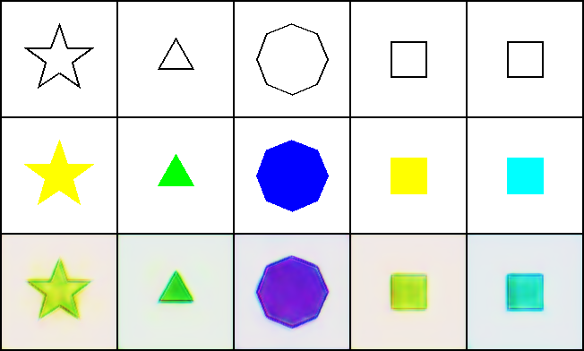
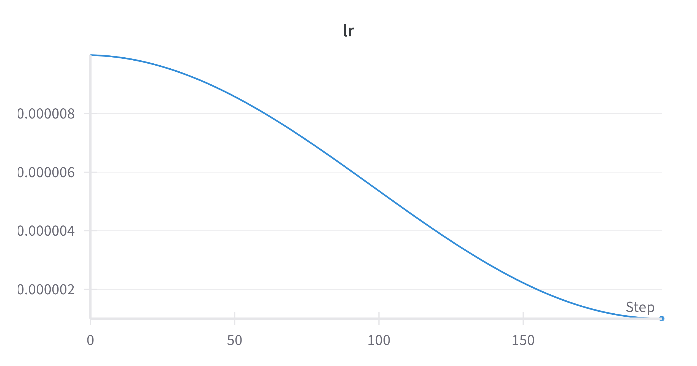
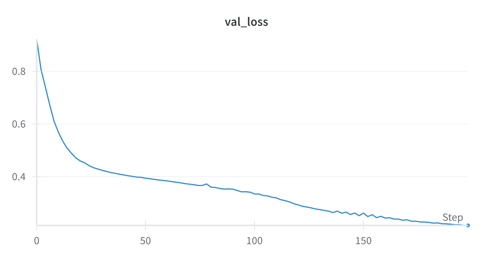

# polygon-coloring
a cross attention unet for coloring polygons based on input


### Notebooks
I trained using notebooks, so just follow along with the train and infer notebooks for interactive workflos

Or

### Command Line
Setup config in config.py

and  run the scripts
```bash
python train.py

python infer.py
```

--- 

  
10 most recent loss curves

## Sample Predictions

Here’s how the model’s output evolves over training:

  
*Figure 1: Predictions at the very start of training.*

  
*Figure 2: Predictions halfway through training.*

  
*Figure 3: Predictions after full training.*

---

## Learning Rate Schedule

  
*Figure 4: Cosine annealing learning rate over epochs.*

---

## Final Validation Loss of the winning model

  
*Figure 5: Validation loss curve over epochs.*
